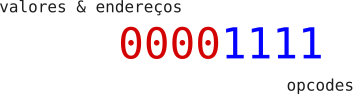

### **SkCode** : Explorando a simplicidade de Programar em binário.

<br>

## Um pouco história
<p align="justify">
Esse pequeno projeto nasceu durante uma brincaderia com uma amiga, a qual falou que durante as férias iria se dedicar bastante nos estudos de programação, que teria como objetivo, voltar programando diretamente em binário por meio de fios, fechando curto direto na memória do computador.  Essa brincadeira me fez lembrar desse <a href="https://pt.m.wikipedia.org/wiki/Altair_8800">computador</a>, onde a programação desses equipamentos eram feitas atraves de chaves eletrônicas que representavam os bits; assim como ela disse na sua brincaderia. Confesso que como um programador com "sindrome de reinventar a roda", eu pensei: porque eu mesmo não faço um  "emulador" com essa abordagem, e a desafio à codar alguma coisa nele?. Então assim nasceu esse microprojeto. 
</p>


## Estrutura da "máquina" 

<p align="justify">
Se vc tem um pouco de conhecimento em estrutura de dados e conhecimento sobre arquitetura de computadores,  vc não terá dificuldade alguma para compreender e brincar no editor. 
</p>

<p align="justify">
O "hardware" do SkCode possue apenas um acumulador e suporte a instruções de 8 bits, sendo que os 4 bits a esquerda representam valores ou endereços, e os demais bits à direita, são para as instruções da máquina. Ela possue 2 memórias separadas<a href="https://www.google.com.br/search?q=arquitetura+de+harvard"> [ arquitetura harvard ] </a>,  data memory com 16 bytes, e Struction memory com 28 bytes. Note que o acumulador suporta 8 bits de informação, mesmo que você esteja limitado a acessar posições ou trabalhar com valores entre -16 e 16, você não terá essa limitação no acumulador ou quando precisar salvar esse valor na data memory. Ao total a máquina é composta por um conjunto de 8 instruções sem <a href='https://www.google.com/search?q=mnem%C3%B4nicos+assembly'>mnemônicos </a>; Você precisará escrever diretamente em bínario:
</p>


## Instruções 

```txt

IM -> Instruction memory
DM -> Data Memory

    1, 0000-1010    ; Salva o valor do acumulador na DM
    2, 0000-1111    ; Carrega da DM para o acumulador 
    3, 0000-0101    ; Soma o valor contido no endereço no acumulador
    4, 0000-1110    ; Pula para o endereço especificado no IM 
    5, 0000-1011    ; Pula, se o acumulador for igual (zero) 0
    6, 0000-1101    ; Pula, se o acumulador for negativo
    7, 0000-1001    ; Adiciona um valor de 4 bits no acumulador
    8, 0000-1100    ; Negativa o valor do endereço na DM
  
Nota: Os traços (-) são meramente ilustrativos, na codificação final eles não são permitidos.

```
<center></center>

## funcionamento
<p align="justify">
A SkCode é baseada na <a href='https://www.google.com/search?q=m%C3%A1quina+neande'>máquina neander</a> com poucas alterações em seu funcionamento, com relação a construção do "hardware", a grosso modo, seria uma versão simplificada quase nula, deixando de lado conceitos e estruturação de componentes eletrônicos <a href='https://www.google.com/search?q=sistemas+digitais'>ver</a>, aproveitando-se apenas de "como" os códigos são executados no hardware.
</p>

- somando 2 números distintos

    ```

        ; somando 6 + 3
        
        01101001  ; atribue 6 no acm
        00011010  ; salva na DM no endereço 1

        00111001  ; atribue 3 no acm
        00101010  ; salva na DM no endereço 2

        00011111  ; carrega o valor 6 no acumulador
        00100101  ; soma 3 no acumulador

    ```


<p align="justify">
Muito código para quase nada! Em qualquer linguagem de programação, você pode simplesmente escrever "6+3", muito mais rápido e produtivo. É por isso que "ninguém" programa em baixo nível usando binário diretamente. Em vez disso, utilizam linguagens de montagem como <a href='https://www.google.com/search?q=assembly'>assembly</a> que contam com um <a href='https://pt.stackoverflow.com/questions/178804/o-que-%C3%A9-assembler'>assembler</a> para fazer a conversão de texto para binário. Por exemplo, é possível escrever um assembler para SkCode que realize essas conversões.
</p>

|opcode        |mnemônico |  opcode | mnemônico | 
|:------------:|:---:|:------------:|:---:|
| 0000-1010    | sta | 0000-1011    | jmz |
| 0000-1111    | lda | 0000-1101    | jmn |
| 0000-0101    | add | 0000-1001    | set |
| 0000-1110    | jmp | 0000-1100    | not |

<br>

<p align="justify">
O projeto está longe de ser algo com credibilidade real quanto ao funcionamento de uma CPU. No entanto, acredito que está simples o suficiente para abrir a mente de quem nunca teve contato com assembly ou mesmo com arquitetura de hardware, fornecendo insights e um norte sobre por onde começar. Por fim, quero deixar uma pequena contribuição para quem gosta dessa área e quer saber mais sobre. 
</p>

<br>

## Considerações


<p align="justify">
Há também outras limitações que devem ser levadas em conta. Você só pode codificar 28 linhas, já que a memória de instruções é de apenas 224 bits. Em relação ao código, não espere um código bem organizado e com práticas de boa programação. Este projeto foi algo feito apenas por diversão; não pretendo, em nenhum momento, dar foco nele. Está funcionando e serve para seu propósito inicial. Agradeço se você leu o artigo até aqui e espero que tenha ganhado um pouco de conhecimento, por mínimo que seja. Thanks, see you later.
</p>


<p align="justify"><i>
Quero reforçar que esse projeto, em nenhúm momento foi considerado algo consiso e que vá trazer algum tipo de benefício intelectual para quem usar ou ler esse "artigo", dito isso, se "divirta" e explore o código e veja a maneira mais simples possível de como uma cpu funciona._ 
</i></p>

##

[Visitar](https://lucieudo-roberto.github.io/skcode/)
